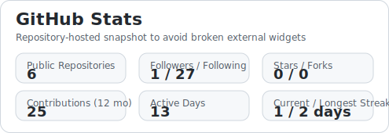
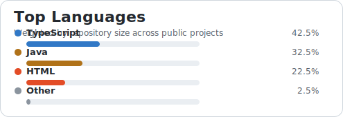
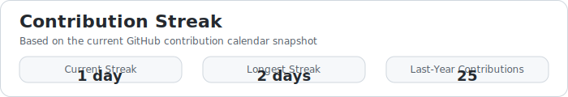
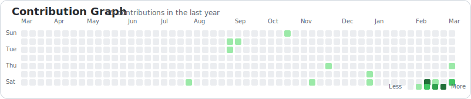
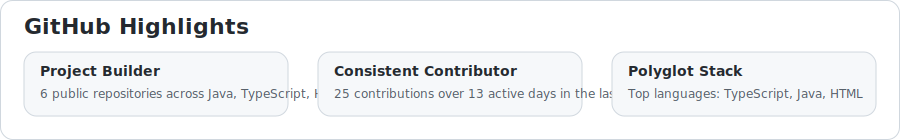
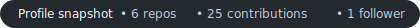

# Hey, I'm Saket 👋

**Software Engineer** · Java · TypeScript · Python

[LinkedIn](https://www.linkedin.com/in/saketramsinghani/) · [Twitter](https://x.com/saket1616830) · [Website](https://saketramsinghani.life/) · [Email](mailto:saket030801@gmail.com)

---

### About Me

- 🔭 Currently building things with **Java, TypeScript & Python**
- 🌱 Always exploring new technologies and tools
- 💬 Ask me about software engineering, backend systems, or anything tech
- ⚡ Open to collaborating on interesting projects

---

### Tech Stack

Java · TypeScript · Python · JavaScript · React · Node.js · Spring · Docker · Git · Linux

---

### GitHub

- [Profile](https://github.com/saketlovescoding)
- [Repositories](https://github.com/saketlovescoding?tab=repositories)
- [Stars](https://github.com/saketlovescoding?tab=stars)
- [Followers](https://github.com/saketlovescoding?tab=followers)

---

### GitHub Stats

---

### Contribution Graph

---

### Trophies

---

