 

 

##  &nbsp;About Me

> Joined GitHub **0** years ago

- Currently building things with **Java, TypeScript & Python**
- Always exploring new technologies and tools
- Open to collaborating on interesting projects

 

##  &nbsp;Tech Stack

<table>
<tr>
<td align="center" width="96">

 <b>Java</b>
</td>
<td align="center" width="96">

 <b>TypeScript</b>
</td>
<td align="center" width="96">

 <b>Python</b>
</td>
<td align="center" width="96">

 <b>JavaScript</b>
</td>
<td align="center" width="96">

 <b>React</b>
</td>
</tr>
<tr>
<td align="center" width="96">

 <b>Node.js</b>
</td>
<td align="center" width="96">

 <b>Spring</b>
</td>
<td align="center" width="96">

 <b>Docker</b>
</td>
<td align="center" width="96">

 <b>Git</b>
</td>
<td align="center" width="96">

 <b>Linux</b>
</td>
</tr>
</table>

 

##  &nbsp;GitHub Stats

| All Time | Last Year | Top Languages (last year) |
|----------|-----------|---------------------------|
| 📦 **15** public repos | 🔥 **130** commits |  |
| 🔥 **223** commits | 📝 **2** issues |  |
| 📋 **4** issues | 🔀 **0** PRs |  |
| 🔀 **0** PRs |  lines added |  |
| ⭐ **1** stars |  lines removed |  |

 

## 🚀 &nbsp;Most Active Projects (Last Year)

- [saketlovescoding](https://github.com/saketlovescoding/saketlovescoding) - 69 commits,  / 
- [react](https://github.com/saketlovescoding/react) - 16 commits,  / 
- [data-structures-and-algorithms](https://github.com/saketlovescoding/data-structures-and-algorithms) - 14 commits,  / 
- [saketramsinghani](https://github.com/saketlovescoding/saketramsinghani) - 12 commits,  / 
- [react-practice](https://github.com/saketlovescoding/react-practice) - 8 commits,  / 
- [Java](https://github.com/saketlovescoding/Java) - 3 commits,  / 
- [typescript-first-steps](https://github.com/saketlovescoding/typescript-first-steps) - 2 commits,  / 
- [hackattic](https://github.com/saketlovescoding/hackattic) - 2 commits,  / 
- [LeetcodeQuestions](https://github.com/saketlovescoding/LeetcodeQuestions) - 1 commits,  / 
- [parsona](https://github.com/saketlovescoding/parsona) - 1 commits,  / 

 

This README auto-updates daily via GitHub Actions

